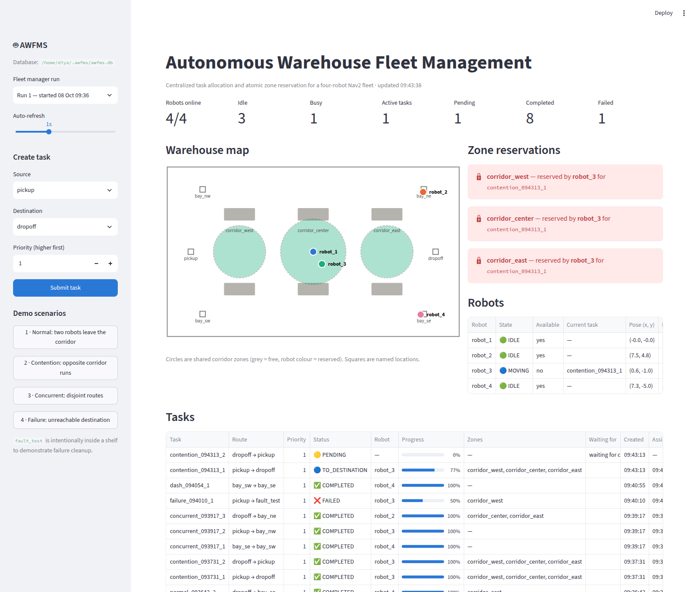
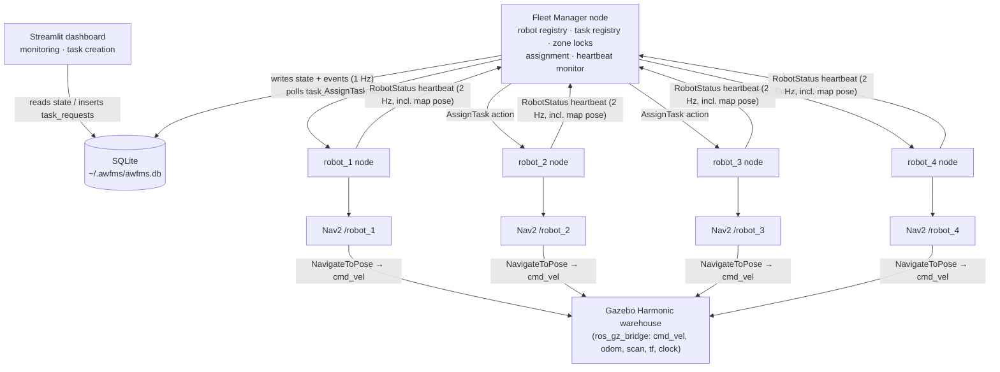
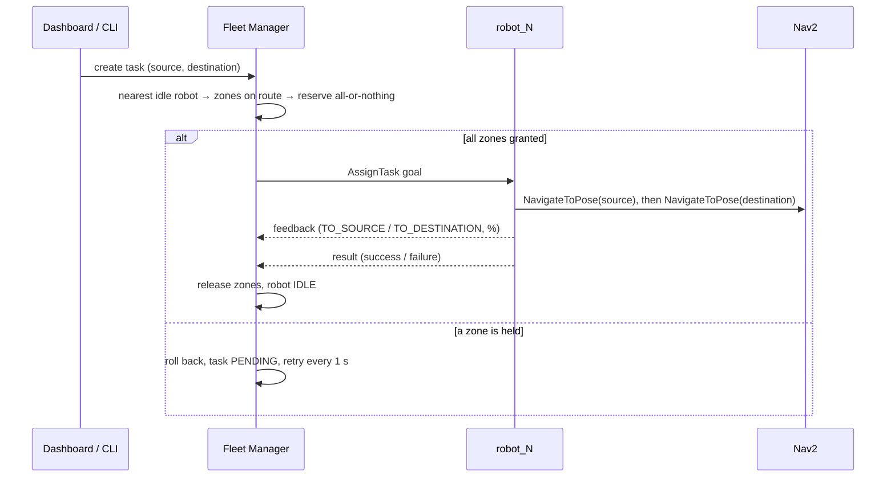

# Autonomous Warehouse Fleet Management System (AWFMS)

> Centralized task allocation and **atomic zone reservation** for a four-robot autonomous warehouse fleet, built on ROS 2 Jazzy, Nav2 and Gazebo Harmonic, with SQLite logging and a Streamlit monitoring dashboard.



*Live dashboard during the contention scenario: robot_3 holds all three corridor zones while it drives past the parked robot_1. The opposite-direction task stays `PENDING` until the zones are released.*

---

## 1. Overview

AWFMS is a simulation-based robotics software project. Four autonomous mobile robots (AGVs) operate in a Gazebo warehouse. A central **Fleet Manager** registers the robots, monitors their heartbeats, accepts transport tasks, picks a robot and coordinates access to the shared corridor so that two tasks never use the same corridor zone at the same time. Each robot navigates autonomously with its own Nav2 stack. Every fleet decision is logged to SQLite and shown live on a Streamlit dashboard, which can also create tasks.

This is a project that demonstrates multi-robot coordination, not an industrial warehouse system. It runs entirely in simulation.

## 2. Problem statement

Nav2 gives each robot local obstacle avoidance and replanning, but no robot knows which shared corridors the other robots are about to use. In a head-on crossing test in this project, local avoidance prevented a collision but one robot eventually aborted with `NO_VALID_PATH`. When several robots need the same aisle they block each other, replan repeatedly, and can fail or deadlock.

AWFMS adds a **fleet-level traffic rule**: a task may only start once it holds every shared zone its route passes through.

## 3. Objectives

- Simulate a multi-robot warehouse (Gazebo Harmonic, 4 differential-drive AGVs with LiDAR and odometry).
- Navigate each robot autonomously on a SLAM-built map (Nav2: AMCL, planner, controller, behaviours).
- Centralize robot registration, heartbeat monitoring, task creation and task assignment.
- Prevent conflicting use of shared corridors with **atomic zone reservation**, queuing and retry.
- Persist tasks, zone events and fleet events in SQLite.
- Monitor and drive the fleet from a web dashboard.

## 4. Architecture



The responsibilities are split deliberately. **The Fleet Manager never drives a robot.** It decides *which* robot does *what* and *when* it may start. Nav2 decides *how* the robot gets there (localization, global planning, local control, obstacle avoidance and recovery).

### ROS 2 communication model

| Mechanism | Used for |
|---|---|
| **Topics** | `/robot/status` heartbeat (robot id, state, map pose), `/fleet_manager/status`, sensor data, odometry, `cmd_vel`, TF, `/clock` |
| **Services** | `/fleet_manager/register_robot`, `/fleet_manager/create_task`, `/fleet_manager/reserve_zone`, `/fleet_manager/release_zone` |
| **Actions** | `/robot_N/assign_task` (Fleet Manager → robot: goal, progress feedback, result); `/robot_N/navigate_to_pose` (robot → its Nav2 stack) |

### Packages

```
awfms_ws/src/
├── awfms_interfaces/        custom msg/srv/action
│   ├── msg/RobotStatus.msg         robot_id, status, x, y
│   ├── srv/RegisterRobot.srv, CreateTask.srv, ReserveZone.srv, ReleaseZone.srv
│   └── action/AssignTask.action    task, source/destination poses → success; feedback: phase + progress
├── awfms_fleet_manager/     Python nodes
│   ├── fleet_manager.py            central coordinator
│   ├── robot_node.py               per-robot task executor (Nav2 client)
│   ├── fleet_db.py                 SQLite persistence (no ROS dependency)
│   ├── demo_tasks.py               CLI to submit the demo scenarios
│   └── test/test_fleet_logic.py    unit tests
└── awfms_bringup/           simulation + navigation configuration
    ├── worlds/warehouse.sdf        enclosed warehouse, 6 shelves, pickup/drop-off areas
    ├── models/robot_{1..4}/        diff-drive AGV with 360° gpu_lidar
    ├── maps/warehouse_map.*        SLAM Toolbox occupancy grid
    ├── config/                     nav2_params, bridge, slam_toolbox, robots
    └── launch/                     fleet, navigation, mapping, warehouse_demo
dashboard/app.py             Streamlit dashboard
```

## 5. Components

### Fleet Manager (`fleet_manager.py`)
Keeps three registries in memory:

- **robot_registry**: type, state (`IDLE`/`MOVING`/`BUSY`/`OFFLINE`), availability, current task, map pose, last heartbeat.
- **task_registry**: source, destination, priority, state, assigned robot, progress, reserved zones, wait reason, timestamps.
- **zone_locks**: `{zone_id: owner_robot or None}`, for example `{"corridor_west": None, "corridor_center": "robot_3", "corridor_east": "robot_3"}`.

Responsibilities:
- registers robots and marks a robot `OFFLINE` after 2 s without a heartbeat;
- validates and creates tasks (from the service or the dashboard queue);
- chooses a robot, reserves zones atomically and dispatches the `AssignTask` action;
- queues tasks that cannot start and retries them every second (higher priority first);
- tracks feedback and results, and releases zones on success, failure or rejection;
- writes state and events to SQLite.

A robot that owns a task stays unavailable even if a stale `IDLE` heartbeat arrives before it starts the goal. This prevents double assignment.

**Robot selection policy:** the *nearest available robot* (straight-line distance from the robot's current pose to the task source) whose zones can be reserved. If the nearest robot's route is blocked, the next nearest is tried. This is a simple heuristic, not an optimizer.

### Robot node (`robot_node.py`)
One per robot, namespaced `/robot_1` … `/robot_4`. It registers with the Fleet Manager and publishes a 2 Hz heartbeat. The heartbeat includes the robot's **map-frame pose**, looked up from TF (`map → robot_N/base_link`, provided by AMCL). The node exposes the `assign_task` action server. A transport task runs as **two Nav2 legs**: `TO_SOURCE` (pick up), then `TO_DESTINATION` (deliver). Progress is computed from Nav2's `distance_remaining`, at 0–50 % per leg. The node reports success or failure honestly when Nav2 aborts.

### Navigation (Nav2) and SLAM
Each robot runs its own Nav2 stack (AMCL, planner_server, controller_server, behavior_server, bt_navigator, waypoint_follower) sharing one `map_server`. The warehouse map was built with **SLAM Toolbox** and is used as a static map (the `mapping.launch.xml` launch file is kept for re-mapping).

### Warehouse world
A 20 × 14 m enclosed warehouse with two rows of three shelves (y = ±3 m), a central corridor between them, north and south aisles, and pickup (x = −8.3) and drop-off (x = +8.3) areas. Named locations used by tasks:

| Location | (x, y) | Notes |
|---|---|---|
| `pickup` | (−8.3, 0.0) | west end of the corridor |
| `dropoff` | (8.3, 0.0) | east end of the corridor |
| `bay_nw` / `bay_ne` | (∓7.5, 5.0) | north aisle |
| `bay_sw` / `bay_se` | (∓7.5, −5.0) | south aisle |
| `fault_test` | (0.0, 3.0) | **deliberately inside shelf_2**, to demonstrate failure handling |

## 6. Novelty: dynamic zone reservation

The shared central corridor is modelled as three logical zones (`zone_id, x, y, radius`):

| Zone | Centre | Radius |
|---|---|---|
| `corridor_west` | (−5, 0) | 2.0 m |
| `corridor_center` | (0, 0) | 2.5 m |
| `corridor_east` | (5, 0) | 2.0 m |

**1. Which zones does a task need?** Its route is approximated as the polyline *robot's current pose → source → destination*. For each zone, `_dist_point_to_segment()` computes the shortest distance from the zone centre to each straight segment. If any segment comes within the zone radius, that zone is required. If the robot's pose is unknown, every zone is assumed to be required (conservative).

**2. Atomic reservation.** The Fleet Manager tries to lock every required zone for that robot. If any zone is held by another robot, the locks taken so far in this attempt are **rolled back**, so a task never holds a partial set of zones (all-or-nothing, like a transaction):

```
robot_3 holds corridor_center
task for robot_2 needs [corridor_west, corridor_center]
  corridor_west   → acquired
  corridor_center → held by robot_3 → roll back corridor_west
  ⇒ no zones held, task stays PENDING ("waiting for corridor_center (held by robot_3)")
```

**3. Queue and retry.** Blocked tasks stay `PENDING` and are retried once a second. The task is dispatched as soon as its zones are free, which in testing was within the same second as the release.

**4. Release.** When the action returns (success, navigation failure or rejection), all of the task's zones are released and the robot becomes available again.



**What this mechanism is not (stated plainly):** zones are computed from straight-line geometry, not from the actual Nav2 plan. All zones are reserved *before* the robot moves and held until the task ends, rather than acquired and released lane by lane during motion. There are no time windows. Areas outside the three zones (aisles, pickup and drop-off areas) are protected only by Nav2's local obstacle avoidance.

## 7. SQLite persistence

`fleet_db.py` writes to `~/.awfms/awfms.db` (override with the fleet manager's `db_path` parameter, or `AWFMS_DB` for the dashboard). It uses WAL mode so dashboard reads never block the writer.

| Table | Contents |
|---|---|
| `runs` | one row per Fleet Manager start |
| `robots` | live snapshot: state, availability, current task, pose, last heartbeat |
| `zones` | live snapshot: owner robot and task per zone |
| `tasks` | per run: route, priority, status, robot, progress, zones, wait reason, created/assigned/finished times, result message |
| `events` | time-stamped `SYSTEM` / `ROBOT` / `TASK` / `ZONE` events (registration, offline, created, pending reason, assigned, phase change, reserved, released, completed, failed) |
| `locations` | named locations published by the Fleet Manager (used by the dashboard) |
| `task_requests` | tasks submitted from the dashboard, with the Fleet Manager's response |

When the Fleet Manager restarts, it clears the live tables, marks tasks left unfinished by the previous run as `FAILED` ("fleet manager restarted"), and keeps all history.

## 8. Streamlit dashboard

`dashboard/app.py` auto-refreshes every 1 s and shows:
- **System overview**: robots online, idle and busy; active, pending, completed and failed tasks.
- **Warehouse map**: shelves, named locations, live robot positions, and corridor zones coloured by the robot that holds them.
- **Zone reservations**: free or reserved, with owner robot and task.
- **Robots**: state, availability, current task, pose, heartbeat age.
- **Tasks**: route, status, robot, progress bar, zones held, *waiting for* reason, timestamps, queue wait time, result message.
- **Charts**: task outcomes per robot; zone reserved, released and blocked counts.
- **Event log**: filterable by category.
- **Task creation**: a form, plus one-click buttons for the four demo scenarios. Run history can be browsed by run.

The dashboard has no ROS dependency. It talks to the fleet only through SQLite, so it can't block or crash the robotics backend.

## 9. Build and run

**Requirements:** Ubuntu 24.04, ROS 2 Jazzy, Gazebo Harmonic (`ros_gz`), Nav2, SLAM Toolbox, Python 3.12.

```bash
# build
cd awfms_ws
source /opt/ros/jazzy/setup.bash
colcon build
source install/setup.bash

# dashboard environment (once, from the repository root)
python3 -m venv .venv
.venv/bin/pip install -r dashboard/requirements.txt
```

**Launch** (terminal 1): Gazebo, robots, bridge, Fleet Manager, robot nodes and four Nav2 stacks:

```bash
ros2 launch awfms_bringup warehouse_demo.launch.xml            # with Gazebo GUI
ros2 launch awfms_bringup warehouse_demo.launch.xml gui:=false # server only, lighter
```

Wait about 30–60 s for all lifecycle managers to report `Managed nodes are active`.

**Dashboard** (terminal 2, repository root):

```bash
.venv/bin/streamlit run dashboard/app.py   # http://localhost:8501
```

## 10. Creating tasks

From the dashboard sidebar (form or scenario buttons), or from the command line:

```bash
ros2 service call /fleet_manager/create_task awfms_interfaces/srv/CreateTask \
  "{task_id: 'task_1', source: 'pickup', destination: 'dropoff', priority: 1}"

ros2 run awfms_fleet_manager demo_tasks normal|contention|concurrent|failure

# inspect / manually hold a zone (e.g. to simulate a blocked corridor)
ros2 service call /fleet_manager/reserve_zone awfms_interfaces/srv/ReserveZone "{robot_id: 'robot_1', zone_id: 'corridor_center'}"
ros2 service call /fleet_manager/release_zone awfms_interfaces/srv/ReleaseZone "{robot_id: 'robot_1', zone_id: 'corridor_center'}"
```

## 11. Demo scenarios

Run them in this order from a fresh launch (all robots start parked in the corridor at x = −2, 0, 2, 4):

| # | Scenario | Tasks | Expected behaviour |
|---|---|---|---|
| 1 | **Normal** | pickup→bay_nw, dropoff→bay_se | robot_3 takes west+center and robot_4 takes east. Disjoint zones, so **both run at once**. |
| 2 | **Contention** | pickup→dropoff, dropoff→pickup | the first task holds **all three zones**; the second is `PENDING: waiting for corridor_west (held by robot_3)`. On completion the zones are released and the second task is dispatched within 1 s. |
| 3 | **Concurrent** | bay_se→bay_sw, pickup→bay_nw, dropoff→bay_ne | three robots move at once: two need no shared zones, one holds center+east. |
| 4 | **Failure** | pickup→fault_test | Nav2 can't reach a goal inside a shelf, so the task goes `FAILED`, its zone is released and the robot becomes `IDLE`. |

## 12. Testing

**Unit tests** (11, no simulator needed):

```bash
cd awfms_ws && source install/setup.bash
python3 -m pytest src/awfms_fleet_manager/test/test_fleet_logic.py -v
```

They cover point-to-segment geometry, zone selection along routes, atomic rollback, the contention queue and release, release on failure, concurrent disjoint tasks, the stale-heartbeat race, invalid and duplicate tasks, SQLite sync with the dashboard request queue, and restart recovery.

**End-to-end runs** in the full simulation (4 robots, 4 Nav2 stacks, headless Gazebo). After every scenario, robot positions were checked against Gazebo ground truth:

| Scenario | Result |
|---|---|
| Normal | 2/2 completed concurrently, zones released |
| Contention (run twice) | second task pending with correct reason, dispatched in the same second its zones were released, 2/2 completed |
| Concurrent | 3/3 completed simultaneously |
| Failure | task `FAILED`, zone released, robot available |
| Dashboard-created task | picked up from SQLite within 1 s, completed |

There were no robot–robot collisions, and AMCL stayed within 0.15 m of ground truth.

### Simulation issues found and fixed during integration
- **Robots were invisible to each other's LiDAR.** The scan plane (0.35 m) was above the 0.2 m-tall chassis, so a moving robot pushed parked robots aside, and the resulting wheel slip corrupted odometry. The chassis is now 0.4 m tall (0.1–0.5 m above the floor). Robots now detect each other, and a robot does not detect itself.
- **The SLAM map was offset 0.525 m in x** from the Gazebo world and had a phantom wall line across the drop-off approach, which caused `NO_VALID_PATH` near the east wall. The map origin was corrected and stray pixels on open floor removed. Localization error dropped from about 0.5 m to under 0.15 m.

## 13. Limitations

- Simulation only; no physical robots.
- Zones are chosen by **straight-line geometry**, not from the real Nav2 path, which may detour (for example through gaps between shelves).
- Zones are **reserved for the whole task** before motion starts and released at the end. There is no lane-by-lane acquisition and no time windows, so corridor use is conservative.
- Only the central corridor is zoned. Aisles and pickup/drop-off areas rely on Nav2 local avoidance, and an idle robot parked on a destination can block that goal.
- Robot selection is a nearest-distance heuristic; there is no multi-objective scheduling, battery model or load balancing.
- A robot going offline mid-task is detected and logged, but the task is not automatically reassigned.
- Four Nav2 stacks plus Gazebo are CPU-heavy. On a laptop, Nav2 lifecycle bring-up can occasionally time out; relaunch if a stack doesn't report active.

## 14. Future work

- Reserve zones from the actual Nav2 global plan, and release each zone as the robot leaves it.
- Time-windowed reservations and deadlock detection across larger zone graphs.
- Zone coverage for aisles and docking areas, with parking-spot management.
- Smarter allocation: travel cost along the planned path, battery, priority aging.
- Automatic reassignment when a robot goes offline mid-task.
- Physical robot deployment.

## Documentation

- `docs/Software_Requirements_Specification.pdf` (IEEE 830)
- `docs/SDLC_Process_Model_Selection.pdf`

## Author

**Diya Jabin** · B.Tech Computer Science and Engineering (Artificial Intelligence and Robotics), VIT Chennai
